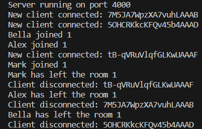

# Chat App Backend

This is the backend service for the Chat App, a real-time messaging application. It's built using Node.js, Express, and Socket.IO.


## Table of Contents

- [Chat App Backend](#chat-app-backend)
  - [Table of Contents](#table-of-contents)
  - [Introduction](#introduction)
  - [Features](#features)
  - [Installation](#installation)
  - [Usage](#usage)
  - [Contributing](#contributing)
  - [License](#license)

## Introduction

The backend of Chat App handles real-time communication between users, manages chat rooms, and stores user data. It's designed to be robust, efficient, and scalable, providing a seamless chatting experience.





## Features

The backend service offers the following features:

- **Real-Time Messaging**: Facilitates real-time communication between users.
- **Chat Rooms**: Supports multiple chat rooms where users can join and communicate.
- **User Management**: Handles connections, disconnections, and user data management.
- **Private Messaging**: Allows users to send private messages to each other.


## Installation

To set up the backend service on your local machine:

1. Clone the repository:

   ```bash
   git clone https://github.com/blockchaincyberpunk1/chat-app-server.git
   ```

2. Navigate to the server directory:

   ```bash
   cd chat-app/server
   ```

3. Install the required dependencies:

   ```bash
   npm install
   ```

4. Start the server:

   ```bash
   npm start
   ```

For additional setup instructions and troubleshooting, consult the [Installation Guide](docs/installation-guide.md).

## Usage

Once the server is running, it will listen for incoming socket connections from the Chat App frontend. You can integrate it with any frontend service that follows the same communication protocol.  Please refer to our [User Manual](docs/user-manual.md). 

## Contributing

Contributions to the Chat App backend are welcome! If you have suggestions for improvements or encounter any issues, please feel free to open an issue or submit a pull request.  Please check our [Contribution Guidelines](CONTRIBUTING.md) for details on how to get involved.

## License

This project is open-sourced under the MIT License. See the LICENSE file for more details.

